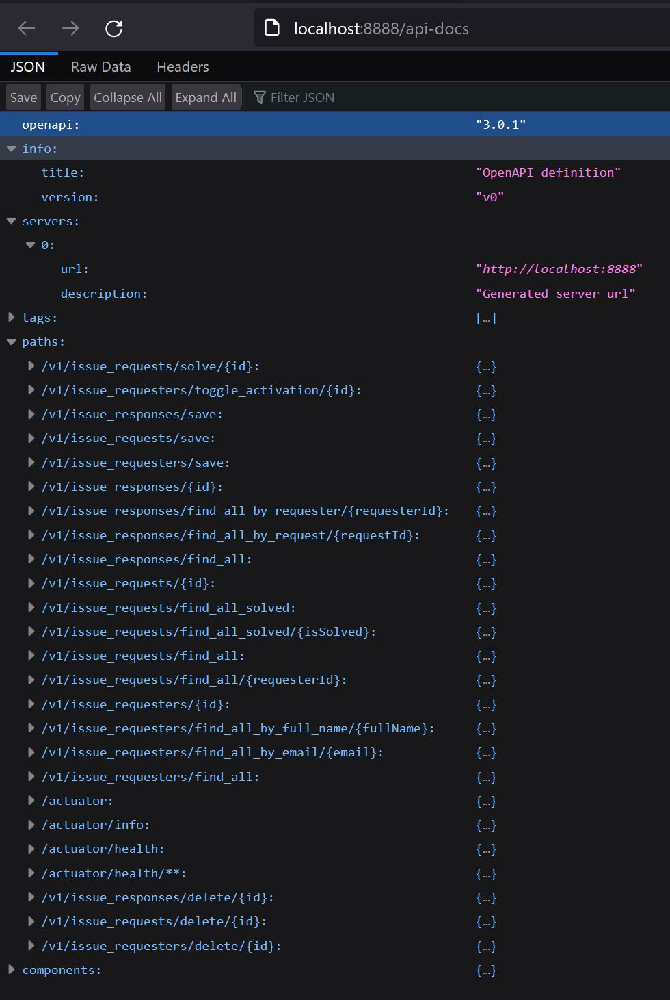

# Dummy Helpdesk API

## Technologies Used
- Java 17 – the programming language used to build the project
- Maven – a tool to build and manage the project
- Spring Cloud – helps connect different parts of the system
- Spring Data JPA – makes it easier to work with databases
- MySQL – the database used to store the data
- Hibernate ORM – connects Java objects with database tables
- Google Protocol Buffers – a way to exchange data in a fast and small format
- Protobuf Maven Plugin – generates Java code from .proto files
- JUnit 5 – used for testing the code
- Testcontainers – runs temporary databases in Docker for tests
- Lombok – reduces boilerplate code in Java classes
- HashiCorp Vault – tool that stores secrets (like passwords and connection strings) safely

## Installation & Execution
You need the latest [Docker Desktop](https://www.docker.com/products/docker-desktop/) to run integration tests with the Maven Surefire plugin.
### Base [Docker](https://www.docker.com/products/docker-desktop/) Images for Integration Tests
* #### Testcontainers version 0.12.0
```sh
docker pull testcontainers/ryuk:0.12.0
```
* #### MySQL version 8.0
```sh
docker pull mysql:8.0
```
---
> **_NOTE:_** The Protobuf compiler is required to build Java classes from the ".proto" files in the 
proto directory. The path to protoc is set in the pom.xml plugin configuration (see protocExecutable), for example:
```xml
<!-- Protobuf codegen (this script uses your protoc path) -->
<plugin>
    <groupId>org.xolstice.maven.plugins</groupId>
    <artifactId>protobuf-maven-plugin</artifactId>
    <version>${protobuf-maven-plugin.version}</version>
    <configuration>
        <protocExecutable>/opt/homebrew/Cellar/protobuf/32.0_1/bin/protoc</protocExecutable>
    </configuration>
    <executions>
        <execution>
            <goals>
                <goal>compile</goal>
                <goal>test-compile</goal>
            </goals>
        </execution>
    </executions>
</plugin>
```
### Building the Project
```sh
./build.sh
```
* The build.sh script pulls and starts MySQL, executes the DDL and seeds some data, pulls and starts Vault, creates the necessary secret, then generates Java sources from the proto directory, runs the tests, and compiles the project.

### Development Mode Guide
#### 1) Run MySQL 8 (Docker)
```bash
docker run -d --name mysql8 \
  -p 3306:3306 \
  -e MYSQL_DATABASE=help_desk \
  -e MYSQL_USER=help_user \
  -e MYSQL_PASSWORD=help_pass \
  -e MYSQL_ROOT_PASSWORD=root_pass \
  mysql:8.0
```

#### 2) Execute DDL Script
```mysql
DROP DATABASE IF EXISTS help_desk;

CREATE
    DATABASE help_desk
    CHARACTER SET utf8mb4
    COLLATE utf8mb4_0900_ai_ci;
USE
    help_desk;

DROP TABLE IF EXISTS issue_response;
DROP TABLE IF EXISTS issue_request;
DROP TABLE IF EXISTS issue_requester;

CREATE TABLE issue_requester
(
    id        INT          NOT NULL AUTO_INCREMENT PRIMARY KEY,
    full_name VARCHAR(255) NOT NULL,
    email     VARCHAR(255) NOT NULL,
    is_active BOOLEAN  DEFAULT TRUE,
    created   DATETIME DEFAULT CURRENT_TIMESTAMP
);

CREATE TABLE issue_request
(
    id           INT  NOT NULL AUTO_INCREMENT PRIMARY KEY,
    requester_id INT  NOT NULL,
    request_body TEXT NOT NULL,
    is_solved    BOOLEAN  DEFAULT FALSE,
    created      DATETIME DEFAULT CURRENT_TIMESTAMP,
    solved       DATETIME NULL,
    FOREIGN KEY (requester_id) REFERENCES issue_requester (id)
        ON DELETE CASCADE ON UPDATE CASCADE
);

CREATE TABLE issue_response
(
    id            INT  NOT NULL AUTO_INCREMENT PRIMARY KEY,
    request_id    INT  NOT NULL,
    requester_id  INT  NOT NULL,
    response_body TEXT NOT NULL,
    created       DATETIME DEFAULT CURRENT_TIMESTAMP,
    FOREIGN KEY (requester_id) REFERENCES issue_requester (id)
        ON DELETE CASCADE ON UPDATE CASCADE,
    FOREIGN KEY (request_id) REFERENCES issue_request (id)
        ON DELETE CASCADE ON UPDATE CASCADE
);
```
#### 3) Seed Test Data (SQL)
```mysql
SET FOREIGN_KEY_CHECKS = 0;
TRUNCATE TABLE issue_response;
TRUNCATE TABLE issue_request;
TRUNCATE TABLE issue_requester;
SET FOREIGN_KEY_CHECKS = 1;

INSERT INTO issue_requester (full_name, email)
VALUES ('Ludwig van Beethoven', 'ludwig@beethoven.net');

INSERT INTO issue_request (requester_id, request_body)
VALUES (1, 'Elise is not loving me anymore..!');

INSERT INTO issue_response (request_id, requester_id, response_body)
VALUES (1, 1, 'It is OK... I am not loving her anymore either :P');
```
#### 4) Run Vault (dev mode, Docker)
```bash
docker run -d --name vault \
  -p 8200:8200 \
  -e VAULT_DEV_ROOT_TOKEN_ID=root \
  -e VAULT_DEV_LISTEN_ADDRESS=0.0.0.0:8200 \
  hashicorp/vault:latest \
  server -dev -dev-root-token-id=root -dev-listen-address=0.0.0.0:8200
```
#### 5) Set environment variables on your host terminal
```bash
export VAULT_ADDR=http://localhost:8200
export VAULT_TOKEN=root
```
#### 6) Save your DB settings into Vault (KV v2)
It stores the properties with the same keys Spring uses. Spring will read them directly from `secret/helpdesk`.
```bash
docker exec -e VAULT_ADDR=http://127.0.0.1:8200 -e VAULT_TOKEN=root vault \
  vault kv put secret/helpdesk \
    spring.datasource.url="jdbc:mysql://localhost:3306/help_desk?useSSL=false&allowPublicKeyRetrieval=true&serverTimezone=UTC" \
    spring.datasource.username="help_user" \
    spring.datasource.password="help_pass" \
    spring.datasource.driver-class-name="com.mysql.cj.jdbc.Driver" \
    spring.datasource.hikari.auto-commit="false" \
    spring.datasource.hikari.transaction-isolation="TRANSACTION_READ_COMMITTED" \
    spring.datasource.hikari.minimum-idle="2" \
    spring.datasource.hikari.maximum-pool-size="10" \
    spring.datasource.hikari.pool-name="HikariPool"
```
Check the secret:
```bash
docker exec -e VAULT_ADDR=http://127.0.0.1:8200 -e VAULT_TOKEN=root vault \
  vault kv get secret/helpdesk
```

#### 7) Tell Spring Boot to read from Vault
```yaml
spring:
  application:
    name: helpdesk
  config:
    import: optional:vault://   # reads config from Vault at startup
  cloud:
    vault:
      enabled: true
      uri: ${VAULT_ADDR}        # reads Vault address from environment variable
      token: root
      kv:
        enabled: true
        backend: secret
        application-name: ${spring.application.name}
```

#### 8) Start the API
```sh
./run.sh
```

The run.sh script:
- Checks if the Vault secret secret/helpdesk exists and creates it if missing.
- Prints the Vault secret to confirm values.
- Runs the Spring Boot application with mvn spring-boot:run.
### Open API Documentation (in JSON)
```sh
curl localhost:8888/api-docs
```

### Example API Calls
#### JSON (HTTP/1.1)
```sh
curl --header "accept: application/json" localhost:8888/v1/issue_requesters/1
```
#### XML (HTTP/1.1)
```sh
curl --header "accept: application/xml" localhost:8888/v1/issue_requesters/1
```
#### gRPC / Binary (HTTP/2)
```sh
curl localhost:8888/v1/issue_requesters/1
```

### License
The MIT License (MIT)
Copyright © 2025

Permission is hereby granted, free of charge, to any person obtaining a copy of this software and associated documentation files (the “Software”), to deal in the Software without restriction, including without limitation the rights to use, copy, modify, merge, publish, distribute, sublicense, and/or sell copies of the Software, and to permit persons to whom the Software is furnished to do so, subject to the following conditions:

The above copyright notice and this permission notice shall be included in all copies or substantial portions of the Software.

THE SOFTWARE IS PROVIDED “AS IS”, WITHOUT WARRANTY OF ANY KIND, EXPRESS OR IMPLIED, INCLUDING BUT NOT LIMITED TO THE WARRANTIES OF MERCHANTABILITY, FITNESS FOR A PARTICULAR PURPOSE AND NONINFRINGEMENT. IN NO EVENT SHALL THE AUTHORS OR COPYRIGHT HOLDERS BE LIABLE FOR ANY CLAIM, DAMAGES OR OTHER LIABILITY, WHETHER IN AN ACTION OF CONTRACT, TORT OR OTHERWISE, ARISING FROM, OUT OF OR IN CONNECTION WITH THE SOFTWARE OR THE USE OR OTHER DEALINGS IN THE SOFTWARE.
