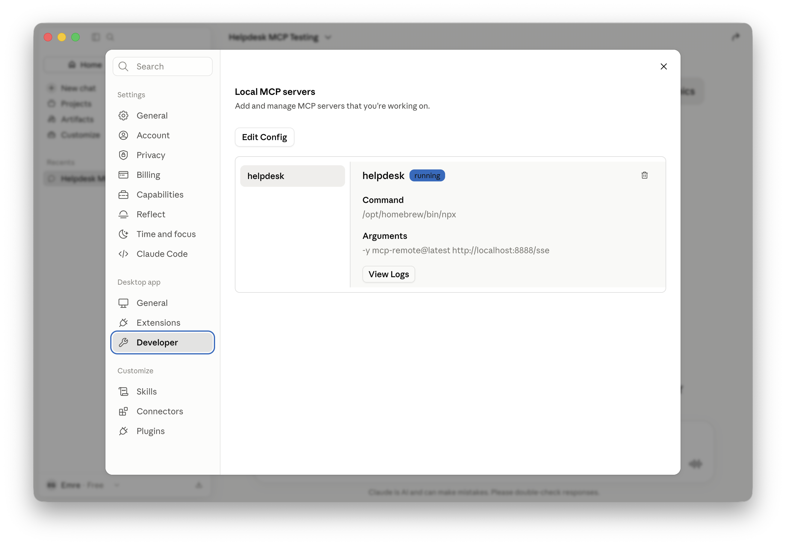
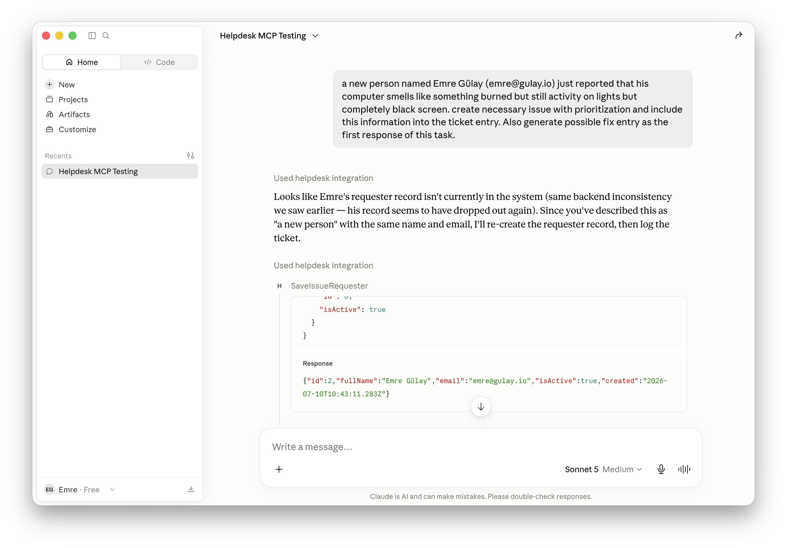
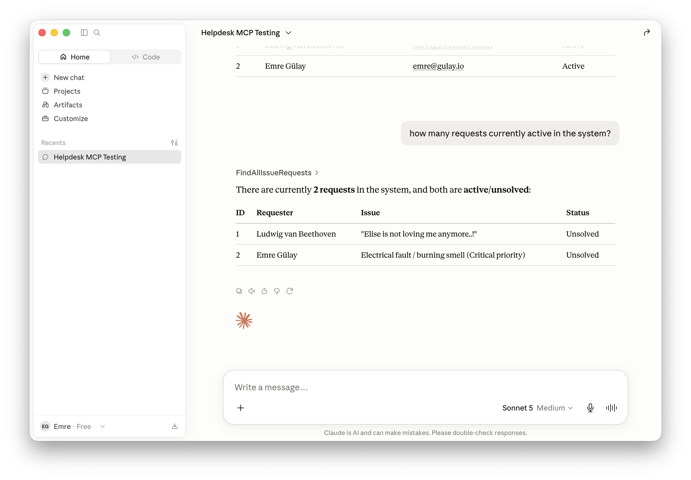
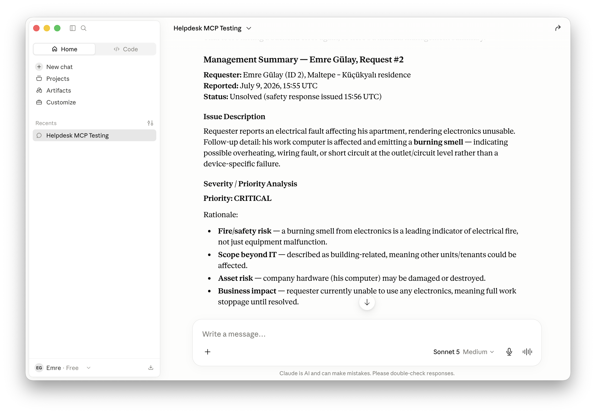
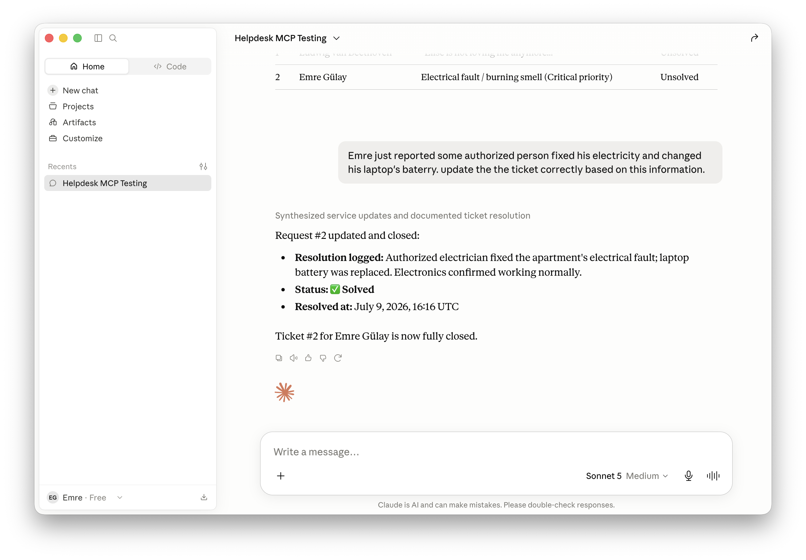
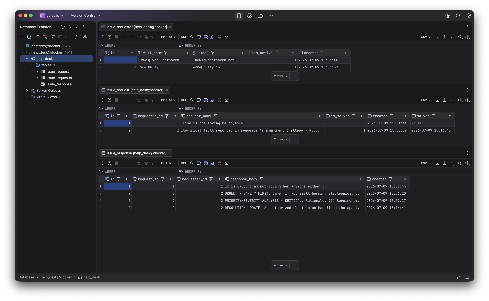
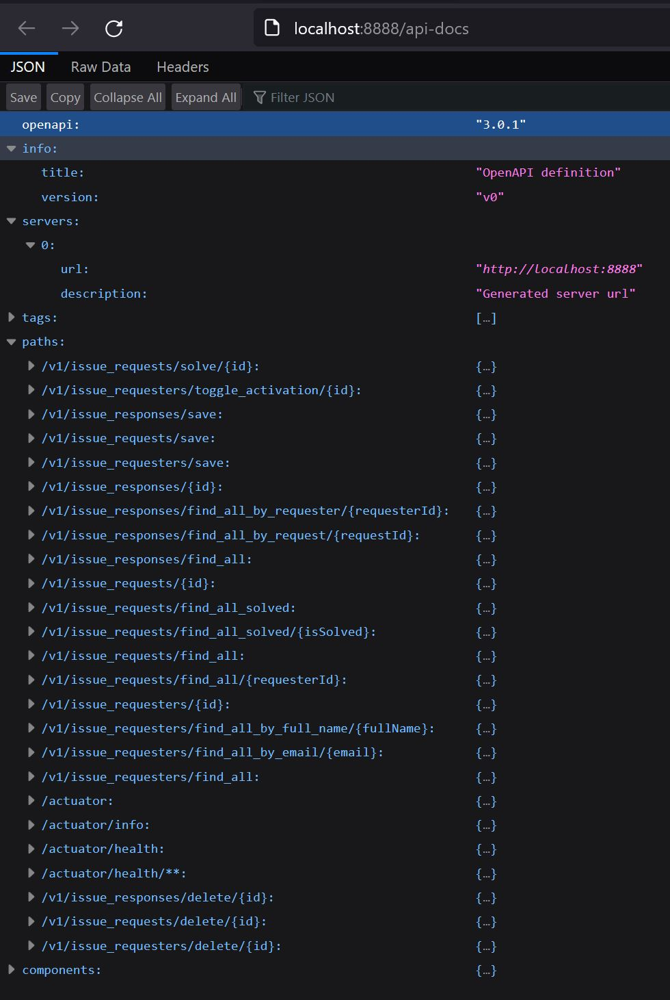

# Dummy Helpdesk API

Helpdesk is a Spring Boot application that exposes a helpdesk data model through REST endpoints, protobuf-based HTTP endpoints, and an embedded MCP server for AI clients. It uses MySQL for persistence, Vault for secrets, and OpenAI for assistant-style MCP tools.

## Overview

The project contains:

- a REST API for managing issue requesters, requests, and responses
- protobuf message definitions for typed request and response payloads
- an embedded Spring AI MCP server that exposes selected backend operations as tools
- an assistant layer that uses OpenAI for summarization and response generation

## Technologies Used

- Java 17
- Maven
- Spring Boot
- Spring Cloud
- Spring Cloud Vault
- Spring Data JPA
- MySQL
- Hibernate ORM
- Google Protocol Buffers
- Protobuf Maven Plugin
- Spring AI
- Model Context Protocol (MCP)
- OpenAI Java SDK
- JUnit 5
- Testcontainers
- Lombok
- HashiCorp Vault

## Prerequisites

- Docker Desktop
- Java 17
- Maven
- `protoc` installed locally

The project uses the protobuf Maven plugin to generate Java classes from the `.proto` files. The current `pom.xml` points to a specific `protoc` path, so adjust that path if your local installation differs.

For integration tests, you may also want to pre-pull the Docker images used by Testcontainers:

```bash
docker pull testcontainers/ryuk:0.12.0
docker pull mysql:8.0
```

## Quick Start

The fastest way to build and run everything is:

```bash
./build.sh
```

That script:

- starts MySQL
- creates the database schema
- seeds sample data
- starts Vault
- creates the required Vault secret
- patches OpenAI settings into Vault if `OPENAI_API_KEY` is set
- generates Java sources from the protobuf files
- runs the tests
- compiles the project

## Local Development

### 1) Start MySQL 8

```bash
docker run -d --name mysql8 \
  -p 3306:3306 \
  -e MYSQL_DATABASE=help_desk \
  -e MYSQL_USER=help_user \
  -e MYSQL_PASSWORD=help_pass \
  -e MYSQL_ROOT_PASSWORD=root_pass \
  mysql:8.0
```

### 2) Create the schema

```mysql
DROP DATABASE IF EXISTS help_desk;

CREATE DATABASE help_desk
    CHARACTER SET utf8mb4
    COLLATE utf8mb4_0900_ai_ci;

USE help_desk;

DROP TABLE IF EXISTS issue_response;
DROP TABLE IF EXISTS issue_request;
DROP TABLE IF EXISTS issue_requester;

CREATE TABLE issue_requester
(
    id         INT NOT NULL AUTO_INCREMENT PRIMARY KEY,
    full_name  VARCHAR(255) NOT NULL,
    email      VARCHAR(255) NOT NULL,
    is_active  BOOLEAN DEFAULT TRUE,
    created    DATETIME DEFAULT CURRENT_TIMESTAMP
);

CREATE TABLE issue_request
(
    id           INT NOT NULL AUTO_INCREMENT PRIMARY KEY,
    requester_id INT NOT NULL,
    request_body TEXT NOT NULL,
    is_solved    BOOLEAN DEFAULT FALSE,
    created      DATETIME DEFAULT CURRENT_TIMESTAMP,
    solved       DATETIME NULL,
    FOREIGN KEY (requester_id) REFERENCES issue_requester (id)
        ON DELETE CASCADE ON UPDATE CASCADE
);

CREATE TABLE issue_response
(
    id            INT NOT NULL AUTO_INCREMENT PRIMARY KEY,
    request_id    INT NOT NULL,
    requester_id  INT NOT NULL,
    response_body TEXT NOT NULL,
    created       DATETIME DEFAULT CURRENT_TIMESTAMP,
    FOREIGN KEY (requester_id) REFERENCES issue_requester (id)
        ON DELETE CASCADE ON UPDATE CASCADE,
    FOREIGN KEY (request_id) REFERENCES issue_request (id)
        ON DELETE CASCADE ON UPDATE CASCADE
);
```

### 3) Seed sample data

```mysql
SET FOREIGN_KEY_CHECKS = 0;
TRUNCATE TABLE issue_response;
TRUNCATE TABLE issue_request;
TRUNCATE TABLE issue_requester;
SET FOREIGN_KEY_CHECKS = 1;

INSERT INTO issue_requester (full_name, email)
VALUES ('Ludwig van Beethoven', 'ludwig@beethoven.net');

INSERT INTO issue_request (requester_id, request_body)
VALUES (1, 'Elise is not loving me anymore..!');

INSERT INTO issue_response (request_id, requester_id, response_body)
VALUES (1, 1, 'It is OK... I am not loving her anymore either :P');
```

### 4) Start Vault in dev mode

```bash
docker run -d --name vault \
  -p 8200:8200 \
  -e VAULT_DEV_ROOT_TOKEN_ID=root \
  -e VAULT_DEV_LISTEN_ADDRESS=0.0.0.0:8200 \
  hashicorp/vault:latest \
  server -dev -dev-root-token-id=root -dev-listen-address=0.0.0.0:8200
```

### 5) Set Vault environment variables

```bash
export VAULT_ADDR=http://localhost:8200
export VAULT_TOKEN=root
```

### 6) Store database settings in Vault

Spring reads the settings directly from `secret/helpdesk`.

```bash
docker exec \
  -e VAULT_ADDR=http://127.0.0.1:8200 \
  -e VAULT_TOKEN=root \
  vault \
  vault kv put secret/helpdesk \
    spring.datasource.url="jdbc:mysql://127.0.0.1:3306/help_desk?useSSL=false&allowPublicKeyRetrieval=true&serverTimezone=UTC" \
    spring.datasource.username="help_user" \
    spring.datasource.password="help_pass" \
    spring.datasource.driver-class-name="com.mysql.cj.jdbc.Driver" \
    spring.jpa.properties.hibernate.dialect="org.hibernate.dialect.MySQLDialect" \
    spring.datasource.hikari.auto-commit="false" \
    spring.datasource.hikari.transaction-isolation="TRANSACTION_READ_COMMITTED" \
    spring.datasource.hikari.minimum-idle="2" \
    spring.datasource.hikari.maximum-pool-size="10" \
    spring.datasource.hikari.pool-name="HikariPool"
```

### 7) Store OpenAI settings in Vault

The OpenAI API key should not be committed to Git. Store it in Vault instead.

```bash
export OPENAI_API_KEY="your-openai-api-key"
export OPENAI_MODEL="gpt-5.2"
```

Patch the existing Vault secret:

```bash
docker exec \
  -e VAULT_ADDR=http://127.0.0.1:8200 \
  -e VAULT_TOKEN=root \
  vault \
  vault kv patch secret/helpdesk \
    helpdesk.ai.openai.api-key="${OPENAI_API_KEY}" \
    helpdesk.ai.openai.model="${OPENAI_MODEL}" \
    spring.ai.openai.api-key="${OPENAI_API_KEY}" \
    spring.ai.openai.chat.options.model="${OPENAI_MODEL}"
```

Check the secret:

```bash
docker exec -e VAULT_ADDR=http://127.0.0.1:8200 -e VAULT_TOKEN=root vault \
  vault kv get secret/helpdesk
```

### 8) Tell Spring Boot to read from Vault

```yaml
spring:
  application:
    name: helpdesk
  config:
    import: optional:vault://
  cloud:
    vault:
      enabled: true
      uri: ${VAULT_ADDR}
      token: ${VAULT_TOKEN}
      kv:
        enabled: true
        backend: secret
        application-name: ${spring.application.name}
```

### 9) Start the API

```bash
./run.sh
```

`run.sh`:

- checks whether the Vault secret `secret/helpdesk` exists and creates it if needed
- patches OpenAI settings into Vault if `OPENAI_API_KEY` is available
- prints the Vault secret to confirm the values
- starts Spring Boot with `mvn spring-boot:run`

## MCP Support

The application includes an embedded Spring AI MCP server in the same Spring Boot process that serves the REST and protobuf-based HTTP endpoints.

The MCP layer exposes the existing service layer as tools for MCP-compatible clients:

```text
MCP Tool -> Existing Service Layer -> Repository -> Database
```

For AI-assisted operations, the MCP layer can also build ticket context, apply a system prompt, and call the configured OpenAI model. The OpenAI API key and model are loaded from Vault, not hardcoded in the source.

MCP tools return JSON-friendly DTOs instead of JPA entities. That keeps tool responses simple and avoids serialization issues for external MCP clients.

### Testing the Embedded MCP Server

Start the application first:

```bash
./run.sh
```

Then run the MCP smoke test in another terminal:

```bash
./test-mcp.sh
```

The script verifies the MCP SSE flow:

```text
SSE connection
    ↓
initialize
    ↓
notifications/initialized
    ↓
tools/list
```

You can also test the MCP server from clients such as MCP Inspector or Claude Desktop.

## Claude Desktop as an MCP Client

Start the application first:

```bash
./run.sh
```

Then configure Claude Desktop by editing:

```text
~/Library/Application Support/Claude/claude_desktop_config.json
```

Example configuration:

```json
{
  "mcpServers": {
    "helpdesk": {
      "command": "/opt/homebrew/bin/npx",
      "args": [
        "-y",
        "mcp-remote@latest",
        "http://localhost:8888/sse"
      ]
    }
  }
}
```

After saving the file, fully restart Claude Desktop. The Helpdesk MCP tools will be discovered automatically and can then be used through natural-language prompts.







### Database Entries



## OpenAPI Documentation

```bash
curl localhost:8888/api-docs
```



### Example API Calls

#### JSON

```bash
curl --header "accept: application/json" localhost:8888/v1/issue_requesters/1
```

#### XML

```bash
curl --header "accept: application/xml" localhost:8888/v1/issue_requesters/1
```

#### Protobuf over HTTP

```bash
curl localhost:8888/v1/issue_requesters/1
```

## License

The MIT License (MIT)
Copyright © 2025

Permission is hereby granted, free of charge, to any person obtaining a copy of this software and associated documentation files (the “Software”), to deal in the Software without restriction, including without limitation the rights to use, copy, modify, merge, publish, distribute, sublicense, and/or sell copies of the Software, and to permit persons to whom the Software is furnished to do so, subject to the following conditions:

The above copyright notice and this permission notice shall be included in all copies or substantial portions of the Software.

THE SOFTWARE IS PROVIDED “AS IS”, WITHOUT WARRANTY OF ANY KIND, EXPRESS OR IMPLIED, INCLUDING BUT NOT LIMITED TO THE WARRANTIES OF MERCHANTABILITY, FITNESS FOR A PARTICULAR PURPOSE AND NONINFRINGEMENT. IN NO EVENT SHALL THE AUTHORS OR COPYRIGHT HOLDERS BE LIABLE FOR ANY CLAIM, DAMAGES OR OTHER LIABILITY, WHETHER IN AN ACTION OF CONTRACT, TORT OR OTHERWISE, ARISING FROM, OUT OF OR IN CONNECTION WITH THE SOFTWARE OR THE USE OR OTHER DEALINGS IN THE SOFTWARE.
